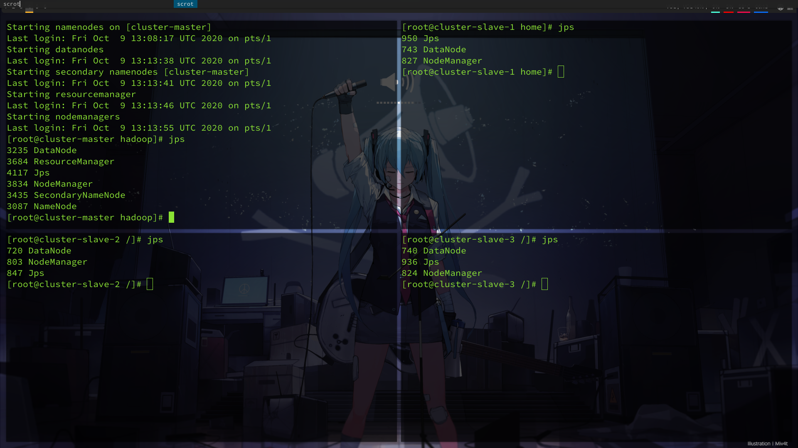
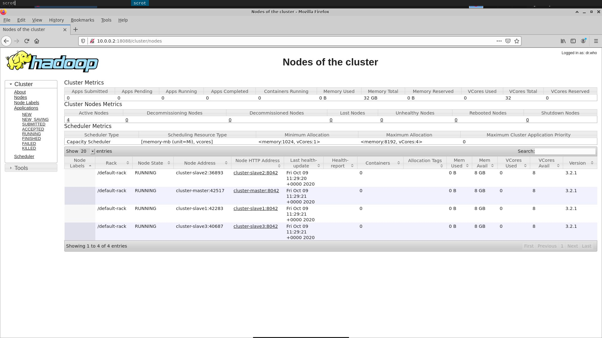
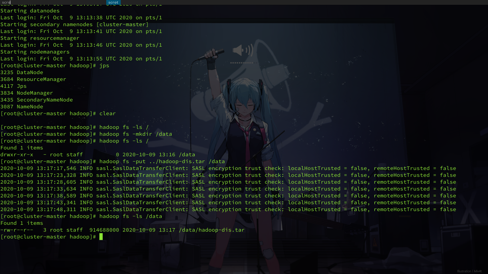
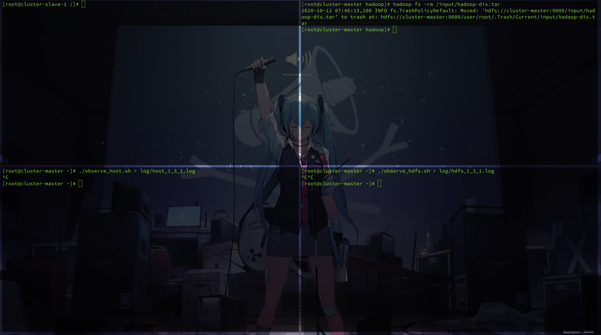

# <center>华中科技大学计算机科学与技术学院</center>  <center>大数据处理实践实验报告</center>  
<center>计科校交 1801</center>  <center>车春池</center>  <center>U201816030</center>  

## TOC

* [引言](#0)  
* [实验目的](#1)   
* [实验环境](#2)   
* [实验内容及步骤](#3)  
* [实验小结](#4)  
* [附录](#5)  
<span id="0"></span>

## 引言
大数据处理平台 Hadoop 是 Apache 基于 Google 的三篇论文《分布式文件系统》，《分布式计算模型》和《Bigtable》的开源系统框架。Hadoop 基本框架包含 HDFS，YARN，MapReduce 编程模型基础类，具体涉及到大数据文件在分布式存取过程中的数据切片，数据组织，副本管理，一致性保证，复制策略和读写访问等，其中各功能模块参数对分布式文件系统的 I/O 性能及分布式大数据处理性能影响较大。  

<span id="1"></span>

## 实验目的
本实验基于 Docker 容器模拟 4 台机器搭建 Hadoop 平台，从黑盒测试和使用角度了解大数据处理系统的模块结构和运行原理，通过比较本机文件系统结构，加深对 HDFS 中系统框架，组件功能，数据一致性，故障容错和副本策略等的理解，以达到以下目的：  
+ 通过运行脚本和进程状态了解分布式文件系统和分布式处理系统的系统结构和功能模块，并能对系统故障进行故障定位排除;
+ 了解 Hadoop 分布式文件系统的结构及其在本地文件系统的映射结构，加深对 Hadoop 集群，数据节点，数据版本一致性，数据块，副本，元数据等的理解;
+ 了解副本数量对实际存储空间的影响及副本在数据节点上复制的顺序;
+ 了解 HDFS 数据块大小对不同大小的数据文件在 HDFS 系统存取性能的影响;
+ 了解 HDFS 故障容错机制及其对数据一致性的影响;
+ 了解副本复制的机架感知策略配置方法;
+ 了解 Hadoop 核心组件参数对 HDFS 存取性能的影响;
+ 自行设计 HDFS 黑盒试验加深对 HDFS 原理的影响;


<span id="2"></span>

## 实验环境
阿里云服务器  
+ CPU：双核  
+ 内存：4 GiB
+ OS：Ubuntu 20.04 64 bit

<span id="3"></span>  

## 实验内容及步骤
### 实验1-1 Hadoop 基本环境搭建及组件进程熟悉

#### 拉取镜像
docker pull daocloud.io/library/centos:latest  

#### 查看镜像是否下载成功
docker image list 查看本机上存在的镜像列表。  

#### 创建固定网络，最好与本机不属于同一个网段
docker network create --subnet=10.0.0.0/16 netgroup

#### 配置 1 主 3 从集群节点IP
cluster-master  
docker run -d -p 18088:18088 -p 9870:9870 --privileged -ti -v /sys/fs/cgroup:/sys/fs/cgroup --name cluster-master -h cluster-master --net netgroup --ip 10.0.0.2 daocloud.io/library/centos /usr/sbin/init  

cluster-slaves  
docker run -d --privileged -ti -v /sys/fs/cgroup:/sys/fs/cgroup --name cluster-slave-1 -h cluster-slave-1 --net netgroup --ip 10.0.0.3 daocloud.io/library/centos /usr/sbin/init  

docker run -d --privileged -ti -v /sys/fs/cgroup:/sys/fs/cgroup --name cluster-slave-2 -h cluster-slave-2 --net netgroup --ip 10.0.0.4 daocloud.io/library/centos /usr/sbin/init  

docker run -d --privileged -ti -v /sys/fs/cgroup:/sys/fs/cgroup --name cluster-slave-3 -h cluster-slave-3 --net netgroup --ip 10.0.0.5 daocloud.io/library/centos /usr/sbin/init  

#### 启动控制台并进入容器
docker exec -it cluster-master /bin/bash
docker exec -it cluster-slave-1 /bin/bash
docker exec -it cluster-slave-2 /bin/bash
docker exec -it cluster-slave-3 /bin/bash

#### 安装openssh
```bash
yum -y install openssh openssh-server openssh-clients  
```

#### 启动ssh服务
```bash
systemctl start sshd  
```

#### 设置 ssh
```bash
vi /etc/ssh/ssh_config
```  
将原来的 StrictHostKeyChecking ask 设置为 StrictHostKeyChecking no，然后去掉注释，保存。  

#### 重新启动ssh服务
```bash
systemctl restart sshd  
```

#### 集群中所有机器执行安装和启动 ssh
在所有客户机上运行：  
```bash
yum -y install openssh openssh-server openssh-clients
systemctl start sshd
```

#### 设置免密登录
安装 passwd，修改密码  
```bash
yum -y install passwd
passwd

ssh-keygen -t rsa
#一路回车
cat ~/.ssh/id_rsa.pub > ~/.ssh/authorized_keys

#分发密钥文件，免密登录
ssh root@cluster-slave-1 'mkdir ~/.ssh'
scp ~/.ssh/authorized_keys root@cluster-slave-1:~/.ssh
ssh root@cluster-slave2 'mkdir ~/.ssh'
scp ~/.ssh/authorized_keys root@cluster-slave-2:~/.ssh
ssh root@cluster-slave3 'mkdir ~/.ssh'
scp ~/.ssh/authorized_keys root@cluster-slave-3:~/.ssh
```

#### 安装 ansible 用于分发
```bash
yum -y install epel-release
yum -y install ansible
```

#### 修改ansible集群配置
```bash
vi /etc/ansible/hosts

[cluster]
cluster-master
cluster-slave-1
cluster-slave-2
cluster-slave-3

[master]
cluster-master

[slaves]
cluster-slave-1
cluster-slave-2
cluster-slave-3
```

#### 追加配置，防止被重写
```bash
vi ~/.bashrc

:>/etc/hosts
cat >>/etc/hosts<<EOF
127.0.0.1   localhost
10.0.0.2  cluster-master
10.0.0.3  cluster-slave-1
10.0.0.4  cluster-slave-2
10.0.0.5  cluster-slave-3
EOF

source ~/.bashrc
```

#### 分发配置
```bash
ansible cluster -m copy -a "src=~/.bashrc dest=~/"
```

#### 分发安装 java sdk
```bash
ansible cluster -m yum -a "name=java-1.8.0-openjdk,java-1.8.0-openjdk-devel state=latest"
```

#### 安装hadoop安装包，在清华镜像选择版本，下载至 /opt 目录下，解压并建立链接
```bash
cd /opt
wget http://mirrors.tuna.tsinghua.edu.cn/apache/hadoop/common/hadoop-3.2.1/hadoop-3.2.1.tar.gz
tar -xzvf hadoop-3.2.1.tar.gz 
ln -s hadoop-3.2.1 hadoop
```
#### 设置 JAVA 和 HADOO P环境
```bash
vi ~/.bashrc

# hadoop
export HADOOP_HOME=/opt/hadoop
export PATH=$HADOOP_HOME/bin:$HADOOP_HOME/sbin:$PATH

#j ava
export JAVA_HOME=/usr/lib/jvm/java-1.8.0-openjdk-1.8.0.262.b10-0.el8_2.x86_64 #注意版本和目录
export PATH=$JAVA_HOME/bin:$PATH
```

#### 设置 Hadoop 配置文件
下面这四个文件在下载的 Hadoop 目录的 ./etc/hadoop/ 目录下。  
core-site.xml  
```html
<configuration>
    <property>
        <name>hadoop.tmp.dir</name>
        <value>/home/hadoop/tmp</value>
        <description>A base for other temporary directories.</description>
    </property>
    <!-- file system properties -->
    <property>
        <name>fs.default.name</name>
        <value>hdfs://cluster-master:9000</value>
    </property>
    <property>
    <name>fs.trash.interval</name>
        <value>4320</value>
    </property>
</configuration>
```
hdfs-site.xml  
```html
<property>
   <name>dfs.namenode.name.dir</name>
   <value>/home/hadoop/tmp/dfs/name</value>
 </property>
 <property>
   <name>dfs.datanode.data.dir</name>
   <value>/home/hadoop/data</value>
 </property>
 <property>
   <name>dfs.replication</name>
   <value>3</value>
 </property>
 <property>
   <name>dfs.webhdfs.enabled</name>
   <value>true</value>
 </property>
 <property>
   <name>dfs.permissions.superusergroup</name>
   <value>staff</value>
 </property>
 <property>
   <name>dfs.permissions.enabled</name>
   <value>false</value>
 </property>
```
mapred-site.xml  
```html
 <configuration>
<property>
  <name>mapreduce.framework.name</name>
  <value>yarn</value>
</property>
<property>
        <name>mapred.job.tracker</name>
        <value>cluster-master:9001</value>
</property>
<property>
  <name>mapreduce.jobtracker.http.address</name>
  <value>cluster-master:50030</value>
</property>
<property>
  <name>mapreduce.jobhisotry.address</name>
  <value>cluster-master:10020</value>
</property>
<property>
  <name>mapreduce.jobhistory.webapp.address</name>
  <value>cluster-master:19888</value>
</property>
<property>
  <name>mapreduce.jobhistory.done-dir</name>
  <value>/jobhistory/done</value>
</property>
<property>
  <name>mapreduce.intermediate-done-dir</name>
  <value>/jobhisotry/done_intermediate</value>
</property>
<property>
  <name>mapreduce.job.ubertask.enable</name>
  <value>true</value>
</property>
</configuration>
```
yarn-site.xml  
```html
<configuration>
    <property>
   <name>yarn.resourcemanager.hostname</name>
   <value>cluster-master</value>
 </property>
 <property>
   <name>yarn.nodemanager.aux-services</name>
   <value>mapreduce_shuffle</value>
 </property>
 <property>
   <name>yarn.nodemanager.aux-services.mapreduce.shuffle.class</name>
   <value>org.apache.hadoop.mapred.ShuffleHandler</value>
 </property>
 <property>
   <name>yarn.resourcemanager.address</name>
   <value>cluster-master:18040</value>
 </property>
<property>
   <name>yarn.resourcemanager.scheduler.address</name>
   <value>cluster-master:18030</value>
 </property>
 <property>
   <name>yarn.resourcemanager.resource-tracker.address</name>
   <value>cluster-master:18025</value>
 </property> <property>
   <name>yarn.resourcemanager.admin.address</name>
   <value>cluster-master:18141</value>
 </property>
<property>
   <name>yarn.resourcemanager.webapp.address</name>
   <value>cluster-master:18088</value>
 </property>
<property>
   <name>yarn.log-aggregation-enable</name>
   <value>true</value>
 </property>
<property>
   <name>yarn.log-aggregation.retain-seconds</name>
   <value>86400</value>
 </property>
<property>
   <name>yarn.log-aggregation.retain-check-interval-seconds</name>
   <value>86400</value>
 </property>
<property>
   <name>yarn.nodemanager.remote-app-log-dir</name>
   <value>/tmp/logs</value>
 </property>
<property>
   <name>yarn.nodemanager.remote-app-log-dir-suffix</name>
   <value>logs</value>
 </property>
</configuration>
```


#### 修改 start-dfs.sh 和 stop-dfs.sh 文件
在文件头部增加：  
```
#!/usr/bin/env bash
HDFS_DATANODE_USER=root
HADOOP_SECURE_DN_USER=hdfs
HDFS_NAMENODE_USER=root
HDFS_SECONDARYNAMENODE_USER=root
```

#### 修改 start-yarn.sh 和 stop-yarn.sh 文件
在文件头部增加：  
```
#!/usr/bin/env bash
YARN_RESOURCEMANAGER_USER=root
HADOOP_SECURE_DN_USER=yarn
YARN_NODEMANAGER_USER=root
```

#### 分发到客户机
```bash
tar -cvf hadoop-dis.tar hadoop hadoop-3.2.1

vi hadoop-dis.yaml
---
- hosts: cluster
  tasks:
    - name: copy .bashrc to slaves
      copy: src=~/.bashrc dest=~/
      notify:
        - exec source
    - name: copy hadoop-dis.tar to slaves
      unarchive: src=/opt/hadoop-dis.tar dest=/opt

  handlers:
    - name: exec source
      shell: source ~/.bashrc
```

#### 开始分发
```bash
ansible-playbook hadoop-dis.yaml
```

#### 格式化 namenode
```bash
hadoop namenode -format
```

#### 启动集群
```bash
cd $HADOOP_HOME/sbin
./start-all.sh
```

#### 实验 1-1 结果
检查 Hadoop 的 Java 进程：  
  
可以看到主节点和从节点均正确启动。  

#### 访问验证
在本地浏览器里面打开下面两个网址：  
```
http://10.0.0.2:18088
http://10.0.0.2:9870
```
结果如下：  
  
在浏览器可以看到 4 个节点都在正常运行。  

### 实验 1-2 本地文件系统与 HDFS 文件系统操作及组织结构
#### 创建目录并上传文件
```bash
hadoop fs -mkdir /input
hadoop fs -ls /
hadoop fs -put [file-to-be-upload] /input
hadoop fs -ls /input
```
结果如下：  
  

#### 观察并分析本地文件系统的目录和 HDFS 文件系统目录的关系
观察如下：  
  

结合 HDFS 原理分析如下：  
+ HDFS 基于本地文件系统，并通过操作本地文件系统来存储数据
+ Hadoop 对本地文件系统封装了一个抽象层，抽象出了 Hadoop 文件系统 HDFS
+ 为了提供统一的数据访问接口，Hadoop 参考了 Linux 的虚拟文件系统实现，引入了 HDFS 抽象文件系统，并提供了大量实现
+ 在上面图中可以看到，本地文件系统里面存储了`元数据`，比如文件名以`blk`开头的文件
+ 在 NameNode 目录下可以看到这里存储了元数据文件，包括`fsimage, editlog, seen_txid`等
+ `fsimage`文件其实是 Hadoop 文件系统元数据的一个永久性的检查点，其中包含 Hadoop 文件系统中的所有目录和文件 idnode 的序列化信息
+ `edits`文件存放的是 Hadoop 文件系统的所有更新操作的路径，文件系统客户端执行的所以写操作首先会被记录到 edits 文件中
+ `VERSION`文件是 Java 属性文件
+ 同时可以看到 SecondaryNameNode 目录下没有`seen_txid`文件
+ 总的来说，HDFS 是比本地文件系统更高层次的文件系统的抽象，将多台机器组成的文件系统看成一个逻辑上的整体


### 实验 1-3 Hadoop 故障及容错恢复
在这个实验中，我写了三个脚本，来帮助我观察 HDFS 目录及本地目录的动态变化，分别是：  
+ observe_host.sh：用于监测主节点本地目录的动态变化
+ observe_hdfs.sh：用于监测 HDFS 目录的动态变化
+ observe_error.sh：用于故障恢复实验监测主节点和从节点和 HDFS 目录的动态变化

脚本的具体内容将会在附录里给出。  

#### NameNode 主备实验
+ 停止 SecondaryNameNode
+ 在 HDFS 上进行文件上传和删除操作
+ 对比 NameNode 和 SecondaryNameNode 目录的变化
+ 监测 HDFS 目录动态变化
+ 停止 NameNode
+ 监测 HDFS 目录动态变化
+ 启动 SecondaryNameNode
+ 监测 HDFS 目录动态变化

实验过程截图：  
  
实验数据由 observe_host.sh 和 observe_hdfs.sh 脚本文件输出重定向到 .log 文件里面，分别有：  
+ host_1_3_1.log
+ host_1_3_2.log
+ hdfs_1_3_1.log
+ hdfs_1_3_2.log
+ hdfs_1_3_3.log
+ hdfs_1_3_4.log

这些 .log 文件的具体内容会在附录给出。  
下面对实验数据进行分析：  


#### DataNode 故障恢复实验
+ 在主节点删除实验 1-2 中上传第 1 步中上传的大文件
+ 删除过程中，快速随机制造故障，关停从节点
+ 监测主节点和从节点和 HDFS 目录的动态变化
+ 恢复启动之前关停节点，监测主节点和从节点的 HDFS 目录的动态变化
+ 等待一段时间后，监测主节点和从节点和 HDFS 目录的动态变化

实验数据由 observe_error.sh 脚本文件输出重定向到 .log 文件里面，分别有：  
+ error_test_1.log
+ error_test_2.log
+ error_test_3.log

这些 .log 文件的具体内容将会在附录给出。  
下面分析总结一下 Hadoop 分布式文件系统的一致性和故障容错恢复机制。  
一致性：  
+ HDFS 采用简单的一致性模型，HDFS 应用需要一个“一次写入多次读取”的文件访问模型。一个文件经过创建、写入和关闭之后就不需要改变。
+ Namenode 启动后会进入一个称为安全模式的特殊状态。处于安全模式的Namenode 是不会进行数据块的复制的。Namenode 从所有的 Datanode 接收心跳信号和块状态报告。
+ Namenode 在内存中保存着整个文件系统的名字空间和文件数据块映射(Blockmap) 的映像。

故障容错恢复：  
+ 故障类型包括三类故障：节点失败，网络故障，数据损坏
+ 故障检测机制有：节点失败检测机制，通信故障检测机制，数据 错误检测机制
+ 写容错：每个 DN 收到数据包后会返回确认应答，如果 NN 没有收到某个 DN 的确认，就会认为这个 DN 挂了，然后调整路线跳过该 DN
+ 读容错：当用户询问数据块的地址时，NN 发送所有 DN 的位置，如果某个 DN 存在故障，那么就可以通过列表从其他 DN 读取数据
+ 数据节点失效：系统会维护两张表，数据块列表和 DN 列表，如果发现某个 DN 上的数据块存在错误，系统会从数据块列表中删除此数据块，如果发现是 DN 失效，系统会同时更新这两张表
+ 系统周期性扫描第一张表，针对那些没有按要求的数量进行复制的数据块，系统会找另外的 DN 从已备份此数据块的 DN 中进行复制
+ HDFS 的备份规则。


### 实验 1-4 Hadoop 参数配置对性能的影响
在这个实验中，我写了一个 top_record.sh 脚本来监测 top 输出的动态变化，这个脚本的具体内容也会在附录中给出。  

+ 修改 hdfs-site.xml 中参数，观察读写性能
+ 将 dfs.block.size 分别设置成为 512KB，16M，32M，64M，128M，256M 的大小，拷贝删除文件
+ 使用 top 统计在 docker 节点的 CPU 和内存变化

通过在 hdfs-site.xml 文件中添加下面几行来修改 dfs.block.size 的值：  
```html
<property>
   <name>dfs.block.size</name>
   <value>size</value>
 </property>
```

实验数据由 top_record.sh 脚本文件输出重定向到 .log 文件，分别有：  
+ top_1M.log(dfs.block.size = 1M)
+ top_100M.log(dfs.block.size = 100M)
+ top_500M.log(dfs.block.size = 500M)

这些 .log 文件的具体内容将会在附录给出。  
通过实验数据分析一下 Hadoop 参数配置对性能的影响：  

<span id="4"></span>

## 实验小结

<span id="5"></span>

## 附录

### 脚本文件
observe_host.sh  
```bash
#!/bin/bash
# Shell for observe /home/hadoop/tmp/dfs/name/, /home/hadoop/tmp/dfs/name/current, /home/hadoop/tmp/dfs/namesecondary/ and /home/hadoop/tmp/dfs/namesecondary/current

while [ 1 ]
do
    ls /home/hadoop/tmp/dfs/name/
    ls -lht /home/hadoop/tmp/dfs/name/current/
    ls /home/hadoop/tmp/dfs/namesecondary/
    ls -lht /home/hadoop/tmp/dfs/namesecondary/current/
    echo ""
    sleep 1s
done

```

observe_hdfs.sh  
```bash
#!/bin/bash
# Shell for observe hdfs

while [ 1 ]
do
    hadoop fs -la /input
    echo ""
    sleep 1s
done


```

observe_error.sh  
```bash
#!/bin/bash
# Shell for observe DataNode error

while [ 1 ]
do
    echo "master"
    tree /home/hadoop/
    echo "slave-1"
    ssh root@cluster-slave-1 "tree /home/hadoop/"
    echo "slave-2"
    ssh root@cluster-slave-2 "tree /home/hadoop/"
    echo "slave-3"
    ssh root@cluster-slave-3 "tree /home/hadoop/"
    echo "hdfs"
    hadoop fs -la /input
    sleep 2s
    echo ""
done

```

top_record.sh  
```bash
#!/bin/bash
# Shell for record top
sleep_sec=$1
print_times=$2
log_file=$3

top -d $sleep_sec -n $print_times -b > $log_file
```

#### NameNode 主备实验结果：  
host_1_3_1.log  
```
current
in_use.lock
total 4.1M
-rw-r--r-- 1 root root 1.0M Oct 12 07:59 edits_inprogress_0000000000000000031
-rw-r--r-- 1 root root    3 Oct 12 07:35 seen_txid
-rw-r--r-- 1 root root  212 Oct 12 07:35 VERSION
-rw-r--r-- 1 root root   62 Oct 12 07:35 fsimage_0000000000000000030.md5
-rw-r--r-- 1 root root  668 Oct 12 07:35 fsimage_0000000000000000030
-rw-r--r-- 1 root root 1.0M Oct 11 02:45 edits_0000000000000000030-0000000000000000030
-rw-r--r-- 1 root root   62 Oct 11 02:45 fsimage_0000000000000000029.md5
-rw-r--r-- 1 root root  668 Oct 11 02:45 fsimage_0000000000000000029
-rw-r--r-- 1 root root 1.0M Oct 10 01:31 edits_0000000000000000029-0000000000000000029
-rw-r--r-- 1 root root   42 Oct 10 01:31 edits_0000000000000000027-0000000000000000028
-rw-r--r-- 1 root root 1.0M Oct 10 01:22 edits_0000000000000000001-0000000000000000026
current
total 1.1M
-rw-r--r-- 1 root root  212 Oct 10 01:32 VERSION
-rw-r--r-- 1 root root  668 Oct 10 01:32 fsimage_0000000000000000028
-rw-r--r-- 1 root root   62 Oct 10 01:32 fsimage_0000000000000000028.md5
-rw-r--r-- 1 root root   42 Oct 10 01:32 edits_0000000000000000027-0000000000000000028
-rw-r--r-- 1 root root 1.0M Oct 10 01:32 edits_0000000000000000001-0000000000000000026
-rw-r--r-- 1 root root   62 Oct 10 01:32 fsimage_0000000000000000000.md5
-rw-r--r-- 1 root root  394 Oct 10 01:32 fsimage_0000000000000000000

current
in_use.lock
total 4.1M
-rw-r--r-- 1 root root 1.0M Oct 12 08:13 edits_inprogress_0000000000000000031
-rw-r--r-- 1 root root    3 Oct 12 07:35 seen_txid
-rw-r--r-- 1 root root  212 Oct 12 07:35 VERSION
-rw-r--r-- 1 root root   62 Oct 12 07:35 fsimage_0000000000000000030.md5
-rw-r--r-- 1 root root  668 Oct 12 07:35 fsimage_0000000000000000030
-rw-r--r-- 1 root root 1.0M Oct 11 02:45 edits_0000000000000000030-0000000000000000030
-rw-r--r-- 1 root root   62 Oct 11 02:45 fsimage_0000000000000000029.md5
-rw-r--r-- 1 root root  668 Oct 11 02:45 fsimage_0000000000000000029
-rw-r--r-- 1 root root 1.0M Oct 10 01:31 edits_0000000000000000029-0000000000000000029
-rw-r--r-- 1 root root   42 Oct 10 01:31 edits_0000000000000000027-0000000000000000028
-rw-r--r-- 1 root root 1.0M Oct 10 01:22 edits_0000000000000000001-0000000000000000026
current
total 1.1M
-rw-r--r-- 1 root root  212 Oct 10 01:32 VERSION
-rw-r--r-- 1 root root  668 Oct 10 01:32 fsimage_0000000000000000028
-rw-r--r-- 1 root root   62 Oct 10 01:32 fsimage_0000000000000000028.md5
-rw-r--r-- 1 root root   42 Oct 10 01:32 edits_0000000000000000027-0000000000000000028
-rw-r--r-- 1 root root 1.0M Oct 10 01:32 edits_0000000000000000001-0000000000000000026
-rw-r--r-- 1 root root   62 Oct 10 01:32 fsimage_0000000000000000000.md5
-rw-r--r-- 1 root root  394 Oct 10 01:32 fsimage_0000000000000000000

......

current
in_use.lock
total 4.1M
-rw-r--r-- 1 root root 1.0M Oct 12 08:13 edits_inprogress_0000000000000000031
-rw-r--r-- 1 root root    3 Oct 12 07:35 seen_txid
-rw-r--r-- 1 root root  212 Oct 12 07:35 VERSION
-rw-r--r-- 1 root root   62 Oct 12 07:35 fsimage_0000000000000000030.md5
-rw-r--r-- 1 root root  668 Oct 12 07:35 fsimage_0000000000000000030
-rw-r--r-- 1 root root 1.0M Oct 11 02:45 edits_0000000000000000030-0000000000000000030
-rw-r--r-- 1 root root   62 Oct 11 02:45 fsimage_0000000000000000029.md5
-rw-r--r-- 1 root root  668 Oct 11 02:45 fsimage_0000000000000000029
-rw-r--r-- 1 root root 1.0M Oct 10 01:31 edits_0000000000000000029-0000000000000000029
-rw-r--r-- 1 root root   42 Oct 10 01:31 edits_0000000000000000027-0000000000000000028
-rw-r--r-- 1 root root 1.0M Oct 10 01:22 edits_0000000000000000001-0000000000000000026
current
total 1.1M
-rw-r--r-- 1 root root  212 Oct 10 01:32 VERSION
-rw-r--r-- 1 root root  668 Oct 10 01:32 fsimage_0000000000000000028
-rw-r--r-- 1 root root   62 Oct 10 01:32 fsimage_0000000000000000028.md5
-rw-r--r-- 1 root root   42 Oct 10 01:32 edits_0000000000000000027-0000000000000000028
-rw-r--r-- 1 root root 1.0M Oct 10 01:32 edits_0000000000000000001-0000000000000000026
-rw-r--r-- 1 root root   62 Oct 10 01:32 fsimage_0000000000000000000.md5
-rw-r--r-- 1 root root  394 Oct 10 01:32 fsimage_0000000000000000000
```

host_1_3_2.log  
```
......

current
in_use.lock
total 4.1M
-rw-r--r-- 1 root root 1.0M Oct 12 08:13 edits_inprogress_0000000000000000031
-rw-r--r-- 1 root root    3 Oct 12 07:35 seen_txid
-rw-r--r-- 1 root root  212 Oct 12 07:35 VERSION
-rw-r--r-- 1 root root   62 Oct 12 07:35 fsimage_0000000000000000030.md5
-rw-r--r-- 1 root root  668 Oct 12 07:35 fsimage_0000000000000000030
-rw-r--r-- 1 root root 1.0M Oct 11 02:45 edits_0000000000000000030-0000000000000000030
-rw-r--r-- 1 root root   62 Oct 11 02:45 fsimage_0000000000000000029.md5
-rw-r--r-- 1 root root  668 Oct 11 02:45 fsimage_0000000000000000029
-rw-r--r-- 1 root root 1.0M Oct 10 01:31 edits_0000000000000000029-0000000000000000029
-rw-r--r-- 1 root root   42 Oct 10 01:31 edits_0000000000000000027-0000000000000000028
-rw-r--r-- 1 root root 1.0M Oct 10 01:22 edits_0000000000000000001-0000000000000000026
current
total 1.1M
-rw-r--r-- 1 root root  212 Oct 10 01:32 VERSION
-rw-r--r-- 1 root root  668 Oct 10 01:32 fsimage_0000000000000000028
-rw-r--r-- 1 root root   62 Oct 10 01:32 fsimage_0000000000000000028.md5
-rw-r--r-- 1 root root   42 Oct 10 01:32 edits_0000000000000000027-0000000000000000028
-rw-r--r-- 1 root root 1.0M Oct 10 01:32 edits_0000000000000000001-0000000000000000026
-rw-r--r-- 1 root root   62 Oct 10 01:32 fsimage_0000000000000000000.md5
-rw-r--r-- 1 root root  394 Oct 10 01:32 fsimage_0000000000000000000

current
in_use.lock
total 4.1M
-rw-r--r-- 1 root root 1.0M Oct 12 08:18 edits_inprogress_0000000000000000031
-rw-r--r-- 1 root root    3 Oct 12 07:35 seen_txid
-rw-r--r-- 1 root root  212 Oct 12 07:35 VERSION
-rw-r--r-- 1 root root   62 Oct 12 07:35 fsimage_0000000000000000030.md5
-rw-r--r-- 1 root root  668 Oct 12 07:35 fsimage_0000000000000000030
-rw-r--r-- 1 root root 1.0M Oct 11 02:45 edits_0000000000000000030-0000000000000000030
-rw-r--r-- 1 root root   62 Oct 11 02:45 fsimage_0000000000000000029.md5
-rw-r--r-- 1 root root  668 Oct 11 02:45 fsimage_0000000000000000029
-rw-r--r-- 1 root root 1.0M Oct 10 01:31 edits_0000000000000000029-0000000000000000029
-rw-r--r-- 1 root root   42 Oct 10 01:31 edits_0000000000000000027-0000000000000000028
-rw-r--r-- 1 root root 1.0M Oct 10 01:22 edits_0000000000000000001-0000000000000000026
current
total 1.1M
-rw-r--r-- 1 root root  212 Oct 10 01:32 VERSION
-rw-r--r-- 1 root root  668 Oct 10 01:32 fsimage_0000000000000000028
-rw-r--r-- 1 root root   62 Oct 10 01:32 fsimage_0000000000000000028.md5
-rw-r--r-- 1 root root   42 Oct 10 01:32 edits_0000000000000000027-0000000000000000028
-rw-r--r-- 1 root root 1.0M Oct 10 01:32 edits_0000000000000000001-0000000000000000026
-rw-r--r-- 1 root root   62 Oct 10 01:32 fsimage_0000000000000000000.md5
-rw-r--r-- 1 root root  394 Oct 10 01:32 fsimage_0000000000000000000

......

```

hdfs_1_3_1.log  
```
drwxr-xr-x   - root staff          0 2020-10-12 08:13 /input
-rw-r--r--   3 root staff          0 2020-10-12 08:13 /input/hadoop-dis.tar._COPYING_
drwx------   - root staff          0 2020-10-12 07:46 /user
drwx------   - root staff          0 2020-10-12 07:46 /user/root
drwx------   - root staff          0 2020-10-12 07:46 /user/root/.Trash
drwx------   - root staff          0 2020-10-12 07:46 /user/root/.Trash/Current
drwx------   - root staff          0 2020-10-12 07:59 /user/root/.Trash/Current/input
-rw-r--r--   3 root staff  915056640 2020-10-10 01:22 /user/root/.Trash/Current/input/hadoop-dis.tar
-rw-r--r--   3 root staff  915056640 2020-10-12 07:51 /user/root/.Trash/Current/input/hadoop-dis.tar1602489554685

drwxr-xr-x   - root staff          0 2020-10-12 08:13 /input
-rw-r--r--   3 root staff  915056640 2020-10-12 08:13 /input/hadoop-dis.tar
drwx------   - root staff          0 2020-10-12 07:46 /user
drwx------   - root staff          0 2020-10-12 07:46 /user/root
drwx------   - root staff          0 2020-10-12 07:46 /user/root/.Trash
drwx------   - root staff          0 2020-10-12 07:46 /user/root/.Trash/Current
drwx------   - root staff          0 2020-10-12 07:59 /user/root/.Trash/Current/input
-rw-r--r--   3 root staff  915056640 2020-10-10 01:22 /user/root/.Trash/Current/input/hadoop-dis.tar
-rw-r--r--   3 root staff  915056640 2020-10-12 07:51 /user/root/.Trash/Current/input/hadoop-dis.tar1602489554685

drwxr-xr-x   - root staff          0 2020-10-12 08:13 /input
-rw-r--r--   3 root staff  915056640 2020-10-12 08:13 /input/hadoop-dis.tar
drwx------   - root staff          0 2020-10-12 07:46 /user
drwx------   - root staff          0 2020-10-12 07:46 /user/root
drwx------   - root staff          0 2020-10-12 07:46 /user/root/.Trash
drwx------   - root staff          0 2020-10-12 07:46 /user/root/.Trash/Current
drwx------   - root staff          0 2020-10-12 07:59 /user/root/.Trash/Current/input
-rw-r--r--   3 root staff  915056640 2020-10-10 01:22 /user/root/.Trash/Current/input/hadoop-dis.tar
-rw-r--r--   3 root staff  915056640 2020-10-12 07:51 /user/root/.Trash/Current/input/hadoop-dis.tar1602489554685

```

hdfs_1_3_2.log  
```
drwxr-xr-x   - root staff          0 2020-10-12 08:13 /input
-rw-r--r--   3 root staff  915056640 2020-10-12 08:13 /input/hadoop-dis.tar
drwx------   - root staff          0 2020-10-12 07:46 /user
drwx------   - root staff          0 2020-10-12 07:46 /user/root
drwx------   - root staff          0 2020-10-12 07:46 /user/root/.Trash
drwx------   - root staff          0 2020-10-12 07:46 /user/root/.Trash/Current
drwx------   - root staff          0 2020-10-12 07:59 /user/root/.Trash/Current/input
-rw-r--r--   3 root staff  915056640 2020-10-10 01:22 /user/root/.Trash/Current/input/hadoop-dis.tar
-rw-r--r--   3 root staff  915056640 2020-10-12 07:51 /user/root/.Trash/Current/input/hadoop-dis.tar1602489554685

drwxr-xr-x   - root staff          0 2020-10-12 08:18 /input
drwx------   - root staff          0 2020-10-12 07:46 /user
drwx------   - root staff          0 2020-10-12 07:46 /user/root
drwx------   - root staff          0 2020-10-12 07:46 /user/root/.Trash
drwx------   - root staff          0 2020-10-12 07:46 /user/root/.Trash/Current
drwx------   - root staff          0 2020-10-12 08:18 /user/root/.Trash/Current/input
-rw-r--r--   3 root staff  915056640 2020-10-10 01:22 /user/root/.Trash/Current/input/hadoop-dis.tar
-rw-r--r--   3 root staff  915056640 2020-10-12 07:51 /user/root/.Trash/Current/input/hadoop-dis.tar1602489554685
-rw-r--r--   3 root staff  915056640 2020-10-12 08:13 /user/root/.Trash/Current/input/hadoop-dis.tar1602490723925


drwxr-xr-x   - root staff          0 2020-10-12 08:18 /input
drwx------   - root staff          0 2020-10-12 07:46 /user
drwx------   - root staff          0 2020-10-12 07:46 /user/root
drwx------   - root staff          0 2020-10-12 07:46 /user/root/.Trash
drwx------   - root staff          0 2020-10-12 07:46 /user/root/.Trash/Current
drwx------   - root staff          0 2020-10-12 08:18 /user/root/.Trash/Current/input
-rw-r--r--   3 root staff  915056640 2020-10-10 01:22 /user/root/.Trash/Current/input/hadoop-dis.tar
-rw-r--r--   3 root staff  915056640 2020-10-12 07:51 /user/root/.Trash/Current/input/hadoop-dis.tar1602489554685
-rw-r--r--   3 root staff  915056640 2020-10-12 08:13 /user/root/.Trash/Current/input/hadoop-dis.tar1602490723925

drwxr-xr-x   - root staff          0 2020-10-12 08:18 /input
drwx------   - root staff          0 2020-10-12 07:46 /user
drwx------   - root staff          0 2020-10-12 07:46 /user/root
drwx------   - root staff          0 2020-10-12 07:46 /user/root/.Trash
drwx------   - root staff          0 2020-10-12 07:46 /user/root/.Trash/Current
drwx------   - root staff          0 2020-10-12 08:18 /user/root/.Trash/Current/input
-rw-r--r--   3 root staff  915056640 2020-10-10 01:22 /user/root/.Trash/Current/input/hadoop-dis.tar
-rw-r--r--   3 root staff  915056640 2020-10-12 07:51 /user/root/.Trash/Current/input/hadoop-dis.tar1602489554685
-rw-r--r--   3 root staff  915056640 2020-10-12 08:13 /user/root/.Trash/Current/input/hadoop-dis.tar1602490723925

drwxr-xr-x   - root staff          0 2020-10-12 08:18 /input
drwx------   - root staff          0 2020-10-12 07:46 /user
drwx------   - root staff          0 2020-10-12 07:46 /user/root
drwx------   - root staff          0 2020-10-12 07:46 /user/root/.Trash
drwx------   - root staff          0 2020-10-12 07:46 /user/root/.Trash/Current
drwx------   - root staff          0 2020-10-12 08:18 /user/root/.Trash/Current/input
-rw-r--r--   3 root staff  915056640 2020-10-10 01:22 /user/root/.Trash/Current/input/hadoop-dis.tar
-rw-r--r--   3 root staff  915056640 2020-10-12 07:51 /user/root/.Trash/Current/input/hadoop-dis.tar1602489554685
-rw-r--r--   3 root staff  915056640 2020-10-12 08:13 /user/root/.Trash/Current/input/hadoop-dis.tar1602490723925

```

hdfs_1_3_3.log  
```
drwxr-xr-x   - root staff          0 2020-10-12 08:18 /input
drwx------   - root staff          0 2020-10-12 07:46 /user
drwx------   - root staff          0 2020-10-12 07:46 /user/root
drwx------   - root staff          0 2020-10-12 07:46 /user/root/.Trash
drwx------   - root staff          0 2020-10-12 07:46 /user/root/.Trash/Current
drwx------   - root staff          0 2020-10-12 08:18 /user/root/.Trash/Current/input
-rw-r--r--   3 root staff  915056640 2020-10-10 01:22 /user/root/.Trash/Current/input/hadoop-dis.tar
-rw-r--r--   3 root staff  915056640 2020-10-12 07:51 /user/root/.Trash/Current/input/hadoop-dis.tar1602489554685
-rw-r--r--   3 root staff  915056640 2020-10-12 08:13 /user/root/.Trash/Current/input/hadoop-dis.tar1602490723925


ls: Call From cluster-master/10.0.0.2 to cluster-master:9000 failed on connection exception: java.net.ConnectException: Connection refused; For more details see:  http://wiki.apache.org/hadoop/ConnectionRefused

```

hdfs_1_3_4.log  
```
ls: Call From cluster-master/10.0.0.2 to cluster-master:9000 failed on connection exception: java.net.ConnectException: Connection refused; For more details see:  http://wiki.apache.org/hadoop/ConnectionRefused

```

#### DataNode 故障恢复实验结果：  
由于这部分实验结果行数太多了，因此不在这里放出来，具体可以到 github 上查看：[datanode_log](https://github.com/SKTT1Ryze/big-data-processing-lab/tree/main/log)  

#### Hadoop 参数影响实验结果：  
top_1M.log  
```
    PID USER      PR  NI    VIRT    RES    SHR S  %CPU  %MEM     TIME+ COMMAND
      1 root      20   0   94400   3064    924 S   0.0   0.1   0:00.16 systemd
     26 root      20   0   93912   4500   3508 S   0.0   0.1   0:00.39 systemd-journal
     28 root      20   0   88500   2080    640 S   0.0   0.1   0:00.58 systemd-udevd
     43 dbus      20   0   53976    892    336 S   0.0   0.0   0:00.11 dbus-daemon

    PID USER      PR  NI    VIRT    RES    SHR S  %CPU  %MEM     TIME+ COMMAND
   9233 root      20   0 2654376  93864  24980 S  88.0   2.3   0:01.76 java
   8596 root      20   0 2907960 322536  26188 S   1.0   8.0   0:11.02 java
   8772 root      20   0 2781144 220348  26984 S   1.0   5.5   0:08.69 java
   8023 root      20   0 2759388 294188  26632 S   0.5   7.3   0:09.12 java

    PID USER      PR  NI    VIRT    RES    SHR S  %CPU  %MEM     TIME+ COMMAND
   9233 root      20   0 2676028 188148  25000 S  27.0   4.7   0:03.92 java
   8169 root      20   0 2747908 221644  25976 S  26.5   5.5   0:08.20 java
   8023 root      20   0 2759388 294680  26632 S   1.5   7.3   0:09.22 java
   8596 root      20   0 2907960 322612  26188 S   1.5   8.0   0:11.08 java

    PID USER      PR  NI    VIRT    RES    SHR S  %CPU  %MEM     TIME+ COMMAND
   9233 root      20   0 2691680 249156  24976 S  43.5   6.2   0:05.20 java
   8169 root      20   0 2747908 221800  25952 S  15.0   5.5   0:08.84 java
   8596 root      20   0 2907960 322804  26164 S   2.0   8.0   0:11.16 java
   8023 root      20   0 2759388 294656  26608 S   0.5   7.3   0:09.24 java

    PID USER      PR  NI    VIRT    RES    SHR S  %CPU  %MEM     TIME+ COMMAND
   8169 root      20   0 2747908 222036  25948 S  19.0   5.5   0:09.74 java
   9233 root      20   0 2703188 263108  25004 S  16.0   6.5   0:06.33 java
   8596 root      20   0 2907960 322800  26160 S   1.5   8.0   0:11.20 java
   8023 root      20   0 2759388 294652  26604 S   0.5   7.3   0:09.26 java

    PID USER      PR  NI    VIRT    RES    SHR S  %CPU  %MEM     TIME+ COMMAND
   9233 root      20   0 2681756 338612  24800 S  13.5   8.4   0:09.15 java
   8169 root      20   0 2747908 224972  25744 S   9.0   5.6   0:11.86 java
   8023 root      20   0 2759388 294712  26400 S   1.0   7.3   0:09.41 java
   8596 root      20   0 2907960 322624  25956 S   1.0   8.0   0:11.40 java

    PID USER      PR  NI    VIRT    RES    SHR S  %CPU  %MEM     TIME+ COMMAND
   9233 root      20   0 2681756 335140  21144 S  12.0   8.3   0:09.92 java
   8169 root      20   0 2747908 222796  22088 S   9.0   5.5   0:12.45 java
   8023 root      20   0 2759388 291136  22744 S   1.0   7.2   0:09.47 java
   8596 root      20   0 2907960 318968  22300 S   1.0   7.9   0:11.48 java
```

top_100M.log  
```
    PID USER      PR  NI    VIRT    RES    SHR S  %CPU  %MEM     TIME+ COMMAND
      1 root      20   0   94400   3104    964 S   0.0   0.1   0:00.15 systemd
     26 root      20   0   93912   2804   1832 S   0.0   0.1   0:00.33 systemd-journal
     28 root      20   0   88500   2060    620 S   0.0   0.1   0:00.58 systemd-udevd
     43 dbus      20   0   53976    416      0 S   0.0   0.0   0:00.04 dbus-daemon

    PID USER      PR  NI    VIRT    RES    SHR S  %CPU  %MEM     TIME+ COMMAND
   4439 root      20   0 2653196 108932  25312 S 103.0   2.7   0:02.07 java
   3456 root      20   0 2917044 318912  15732 S   1.0   7.9   0:18.32 java
   2853 root      20   0 2784436 334484  16016 S   0.5   8.3   0:11.35 java
   3602 root      20   0 2786388 236812  15660 S   0.5   5.9   0:10.53 java

    PID USER      PR  NI    VIRT    RES    SHR S  %CPU  %MEM     TIME+ COMMAND
   4439 root      20   0 2674204 175464  25312 S  82.5   4.4   0:03.72 java
   2999 root      20   0 2738804 191300  15856 S   6.5   4.7   0:12.75 java
   2853 root      20   0 2784436 334484  16016 S   1.0   8.3   0:11.37 java
   3456 root      20   0 2917044 318912  15732 S   1.0   7.9   0:18.34 java

    PID USER      PR  NI    VIRT    RES    SHR S  %CPU  %MEM     TIME+ COMMAND
   4439 root      20   0 2674204 222320  25312 S  22.0   5.5   0:04.16 java
   2999 root      20   0 2738804 191300  15856 S  10.5   4.7   0:12.96 java
   2853 root      20   0 2784436 334528  16012 S   0.5   8.3   0:11.38 java
   3456 root      20   0 2917044 319132  15732 S   0.5   7.9   0:18.35 java

    PID USER      PR  NI    VIRT    RES    SHR S  %CPU  %MEM     TIME+ COMMAND
   4439 root      20   0 2674204 231964  25300 S  13.9   5.8   0:05.06 java
   2999 root      20   0 2738804 191296  15820 S   9.1   4.7   0:13.35 java
   3456 root      20   0 2917044 319620  15696 S   1.4   7.9   0:18.40 java
   3171 root      20   0 2700648 138792  15636 S   0.5   3.4   0:05.58 java

    PID USER      PR  NI    VIRT    RES    SHR S  %CPU  %MEM     TIME+ COMMAND
   4439 root      20   0 2674204 281416  25352 S  30.0   7.0   0:06.28 java
   2999 root      20   0 2738804 191360  15820 S  10.0   4.7   0:13.97 java
   3602 root      20   0 2786388 236844  15656 S   1.5   5.9   0:10.65 java
   3171 root      20   0 2700648 138792  15636 S   0.5   3.4   0:05.59 java

    PID USER      PR  NI    VIRT    RES    SHR S  %CPU  %MEM     TIME+ COMMAND
   4439 root      20   0 2674204 303112  25352 S  12.0   7.5   0:07.69 java
   2999 root      20   0 2738804 191360  15820 S   9.6   4.7   0:14.92 java
   2853 root      20   0 2786484 334508  15924 S   0.5   8.3   0:11.49 java
   3456 root      20   0 2917044 319620  15696 S   0.5   7.9   0:18.57 java

    PID USER      PR  NI    VIRT    RES    SHR S  %CPU  %MEM     TIME+ COMMAND
   3456 root      20   0 2917044 319480  15556 S   2.5   7.9   0:18.72 java
   2999 root      20   0 2738804 191888  15680 S   1.5   4.8   0:15.90 java
   2853 root      20   0 2786484 334536  15776 S   0.5   8.3   0:11.55 java
   3602 root      20   0 2787116 237680  15516 S   0.5   5.9   0:11.17 java

```

top_500M.log  
```
    PID USER      PR  NI    VIRT    RES    SHR S  %CPU  %MEM     TIME+ COMMAND
   5587 root      20   0 2761520 323484  26728 S   6.7   8.0   0:08.20 java
      1 root      20   0   94400   4196   2056 S   0.0   0.1   0:00.15 systemd
     26 root      20   0   93912   3776   2792 S   0.0   0.1   0:00.36 systemd-journal
     28 root      20   0   88500   2572   1132 S   0.0   0.1   0:00.58 systemd-udevd

    PID USER      PR  NI    VIRT    RES    SHR S  %CPU  %MEM     TIME+ COMMAND
   6908 root      20   0 2674968 177328  25372 S 102.0   4.4   0:03.37 java
   5733 root      20   0 2755940 221364  26176 S  19.0   5.5   0:08.28 java
   5587 root      20   0 2761520 329364  26728 S   3.5   8.2   0:08.29 java
   6192 root      20   0 2912228 316000  26136 S   1.0   7.8   0:10.94 java

    PID USER      PR  NI    VIRT    RES    SHR S  %CPU  %MEM     TIME+ COMMAND
   6908 root      20   0 2674968 236384  25412 S  20.9   5.9   0:04.34 java
   5733 root      20   0 2755940 223252  26164 S  16.4   5.5   0:09.09 java
   6192 root      20   0 2912228 315988  26124 S   1.5   7.8   0:10.99 java
   5587 root      20   0 2761520 329476  26716 S   0.5   8.2   0:08.31 java

    PID USER      PR  NI    VIRT    RES    SHR S  %CPU  %MEM     TIME+ COMMAND
   6908 root      20   0 2689596 251136  25400 S  44.1   6.2   0:05.28 java
   5733 root      20   0 2755940 223292  26152 S  21.1   5.5   0:09.54 java
   6192 root      20   0 2912228 316000  26112 S   1.4   7.8   0:11.02 java
   5587 root      20   0 2761520 329460  26700 S   0.5   8.2   0:08.32 java

    PID USER      PR  NI    VIRT    RES    SHR S  %CPU  %MEM     TIME+ COMMAND
   5733 root      20   0 2755940 231884  26152 S  12.5   5.8   0:10.18 java
   6908 root      20   0 2689596 257008  25400 S  12.0   6.4   0:05.83 java
   6192 root      20   0 2912228 316000  26112 S   1.4   7.8   0:11.07 java
   6354 root      20   0 2779160 214660  26992 S   0.5   5.3   0:09.77 java

    PID USER      PR  NI    VIRT    RES    SHR S  %CPU  %MEM     TIME+ COMMAND
   6908 root      20   0 2706364 336932  25400 S  41.0   8.4   0:08.32 java
   5733 root      20   0 2755940 232452  26152 S  16.5   5.8   0:11.66 java
   6192 root      20   0 2912228 316472  26112 S   1.5   7.9   0:11.25 java
   5587 root      20   0 2761520 329660  26700 S   1.0   8.2   0:08.39 java

    PID USER      PR  NI    VIRT    RES    SHR S  %CPU  %MEM     TIME+ COMMAND
   6908 root      20   0 2694252 377484  22668 S  15.5   9.4   0:10.45 java
   5733 root      20   0 2755940 229916  23416 S  10.0   5.7   0:12.81 java
   6192 root      20   0 2912228 313736  23376 S   1.5   7.8   0:11.38 java
   5587 root      20   0 2761520 327240  23952 S   0.5   8.1   0:08.42 java

    PID USER      PR  NI    VIRT    RES    SHR S  %CPU  %MEM     TIME+ COMMAND
   6908 root      20   0 2694252 377400  22220 S  11.4   9.4   0:11.09 java
   5733 root      20   0 2755940 229480  22720 S   9.0   5.7   0:13.30 java
   5587 root      20   0 2761520 327124  23384 S   2.0   8.1   0:08.47 java
   6192 root      20   0 2912228 313040  22680 S   1.0   7.8   0:11.43 java

```
